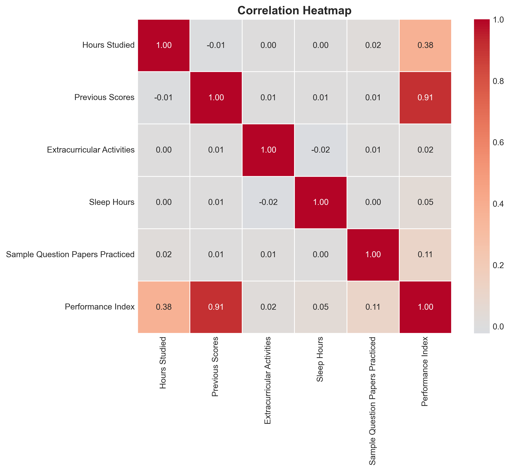
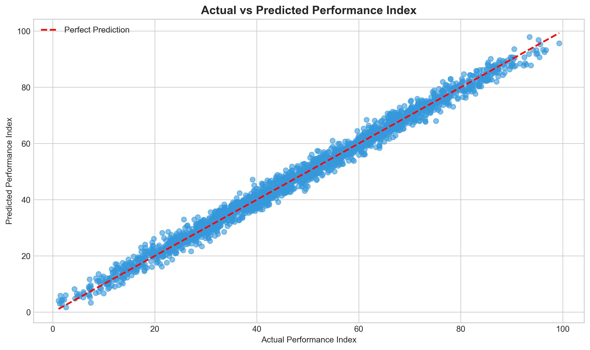

Student Performance Prediction

A beginner-friendly Machine Learning project that predicts student academic performance based on various factors like study hours, previous scores, and extracurricular activities.


- Table of Contents

- [About The Project](#about-the-project)
- [Dataset](#dataset)
- [Technologies Used](#technologies-used)
- [Project Structure](#project-structure)
- [Installation](#installation)
- [Usage](#usage)
- [Results](#results)
- [Key Insights](#key-insights)
- [License](#license)

 About The Project

This project demonstrates the complete Machine Learning workflow:

1.Data Loading & Exploration -      Understanding the dataset
2.Data Visualization- Creating insightful charts
3.Data Preprocessing- Preparing data for modeling
4.Model Training - Using Linear Regression
5.Model Evaluation - Measuring accuracy with R², MAE, RMSE
6.Predictions- Making predictions on new data

Problem Statement

Given student attributes (study hours, previous scores, sleep hours, etc.), predict their **Performance Index.


  Dataset

-Source:[Kaggle - Student Performance Dataset](https://www.kaggle.com/datasets/nikhil7280/student-performance-multiple-linear-regression)

-Records: 10,000 students

- Features: 5 input features + 1 target variable

| Feature | Description |
|---------|-------------|
| Hours Studied | Daily study hours |
| Previous Scores | Scores in previous exams |
| Extracurricular Activities | Yes/No participation |
| Sleep Hours | Average hours of sleep |
| Sample Question Papers Practiced | Number of practice papers |
| Performance Index| Target variable (0-100) |

---

 🛠️ Technologies Used

- Python 3.8+
- pandas- Data manipulation
- numpy - Numerical computing
- matplotlib - Data visualization
- seaborn - Statistical plots
- scikit-learn - Machine Learning


 📁 Project Structure


Student_Marks_Analysis/
│
├── README.md                    # Project documentation
├── requirements.txt              Dependencies
├── .gitignore                   #Git ignore file
│
├── data/
│   └── Student_Performance.csv   # Dataset
│
├── notebooks/
│   └── student_analysis.ipynb    #Main analysis notebook
│
├── images/                       Generated visualizations
│   ├── performance_distribution.png
│   ├── correlation_heatmap.png
│   ├── hours_vs_performance.png
│   └── actual_vs_predicted.png
│
└── models/
    └── linear_regression_model.pkl   Trained model


⚙️ Installation

1. Clone the repository
   ```base
   git clone https://github.com/YOUR_USERNAME/Student_Marks_Analysis.git
   cd Student_Marks_Analysis
   ```

2.Install dependencies
   ```bash
   pip install -r requirements.txt
   ```

3. Download the dataset
   - Download from [Kaggle](https://www.kaggle.com/datasets/nikhil7280/student-performance-multiple-linear-regression)
   - Place `Student_Performance.csv` in the `data/` folder


🚀 Usage

1. Open the Jupyter notebook:
   ```bash
   jupyter notebook notebooks/student_analysis.ipynb
   ```

2. Run all cells to see:
   - Data exploration
   - Visualizations
   - Model training
   - Predictions

---

📈 Results

| Metric | Value |
|--------|-------|
| R² Score | ~98% |
| Mean Absolute Error| ~1.5 |
| RMSE| ~2.0 |

 Sample Visualizations

<p align="center">
  
  
</p>


🔑 Key Insights

1.Hours Studied has the strongest positive correlation with performance

2.Previous Scores are reliable predictors offuture performance  

3.Students with extracurricular activities tend to perform slightly better

4.Sleep hours have moderate impact on performance

5.Practice papers improve scores significantly

---

📄 License

This project is open source and available under the [MIT License](LICENSE).


🤝 Contributing

Contributions, issues, and feature requests are welcome!


👤 Author

Name:- Neha Chauhan 
GitHub: [@nehachauhan-tech](https://github.com/nehachauhan-tech)


This project provides a practical introduction to Machine Learning and demonstrates how data-driven approaches can be used to analyze and predict academic performance.